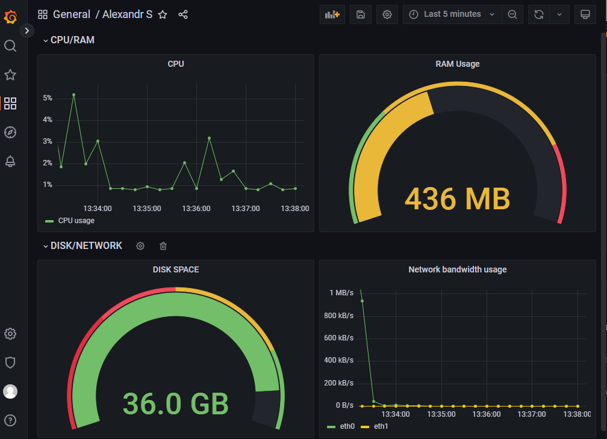

## OTUS Administrator Linux. Professional ДЗ №14: Prometheus

**Задание**

1. Настроить дашборд с 4-мя графиками
   - память;
   - процессор;
   - диск;
   - сеть.
2. Настроить на одной из систем:
   - zabbix (использовать screen (комплексный экран);
   - prometheus - grafana.

_В качестве результата прислать скриншот экрана - дашборд должен содержать в названии имя приславшего._

**_Решение_**

Для решения использован Vagrant в сочетании с ansible. Установка prometheus, node_exporter, grafana производится из бинарных файлов по техническим причинам. В каталог ansible/files/distrib необходимо скопировать файлы:

- prometheus
- node_exporter
- grafana-9.3.2-1.x86_64.rpm

После установки ПО, из резервной копии в каталоге ansible/files/backup восстанавливается преднастроенная БД Grafana, с требуемым dashboard.

Скриншот

